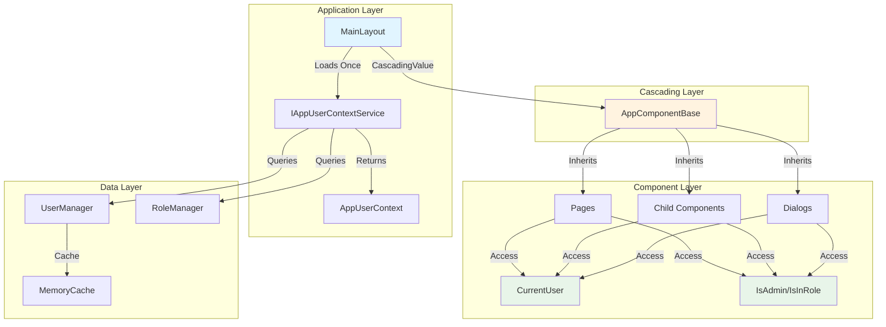
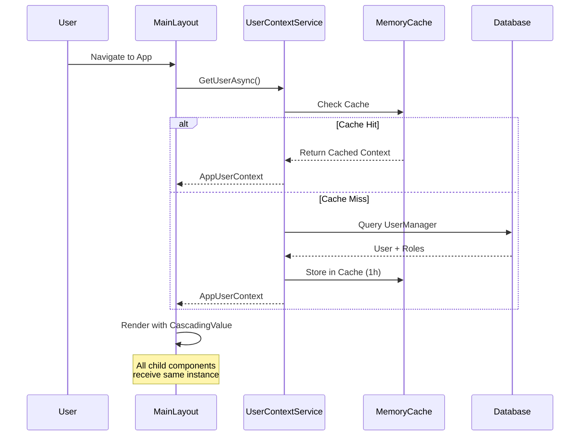

# Building a Robust User Context System in Blazor Server with Cascading Parameters

*A complete guide to implementing authentication-aware components with clean architecture*

---

## The Challenge

When building Blazor Server applications with authentication, you often need to access the current user's information across multiple components: their name, roles, permissions, and other profile data. The naive approach of injecting `AuthenticationStateProvider` into every component leads to repetitive code and tight coupling.

**What if you could access user context as simply as this?**

```razor
@if (IsAdmin)
{
    <MudButton Color="Color.Error">Delete All</MudButton>
}
```

In this guide, we'll build a reusable user context system that works seamlessly across pages, components, and even dialogs, using **Cascading Parameters** for maximum efficiency.

---

## Architecture Overview



### Flow Explanation

1. **MainLayout** loads user context once during initialization
2. **CascadingValue** distributes context to all child components
3. **AppComponentBase** provides a clean API for accessing user data
4. Components inherit from base class and get automatic access to user properties
5. Service layer handles caching and authentication state queries

---

## Step 1: Define the User Context Model

First, create a strongly-typed model to hold user information:

```csharp
// Identity/AppUserContext.cs
namespace YourApp.Identity
{
    public class AppUserContext
    {
        public Guid UserId { get; set; }
        public string UserName { get; set; } = string.Empty;
        public string DisplayName { get; set; } = string.Empty;
        public string Email { get; set; } = string.Empty;
        public string TimeZone { get; set; } = "UTC";
        public bool IsAuthenticated { get; set; }
        public List<string> Roles { get; set; } = new();
    }
}
```

**Why a separate model?**
- Decouples your app from Identity framework specifics
- Allows for custom properties (TimeZone, DisplayName, etc.)
- Easier to test and mock
- Can be serialized/cached efficiently

---

## Step 2: Create the User Context Service

The service is responsible for loading and caching user data:

```csharp
// Services/IAppUserContextService.cs
namespace YourApp.Services
{
    public interface IAppUserContextService
    {
        Task<AppUserContext> GetUserAsync();
        void ClearCache();
    }
}
```

```csharp
// Services/AppUserContextService.cs
using Microsoft.AspNetCore.Components.Authorization;
using Microsoft.AspNetCore.Identity;
using Microsoft.Extensions.Caching.Memory;

namespace YourApp.Services
{
    public class AppUserContextService : IAppUserContextService
    {
        private readonly AuthenticationStateProvider _authStateProvider;
        private readonly UserManager<AppUser> _userManager;
        private readonly IMemoryCache _cache;
        private readonly ILogger<AppUserContextService> _logger;
        private const string CacheKeyPrefix = "UserContext_";

        public AppUserContextService(
            AuthenticationStateProvider authStateProvider,
            UserManager<AppUser> userManager,
            IMemoryCache cache,
            ILogger<AppUserContextService> logger)
        {
            _authStateProvider = authStateProvider;
            _userManager = userManager;
            _cache = cache;
            _logger = logger;
        }

        public async Task<AppUserContext> GetUserAsync()
        {
            var authState = await _authStateProvider.GetAuthenticationStateAsync();
            var user = authState.User;

            if (!user.Identity?.IsAuthenticated ?? true)
            {
                return new AppUserContext { IsAuthenticated = false };
            }

            var userName = user.Identity.Name ?? string.Empty;
            var cacheKey = $"{CacheKeyPrefix}{userName}";

            // Try to get from cache first
            if (_cache.TryGetValue<AppUserContext>(cacheKey, out var cachedContext))
            {
                _logger.LogDebug("User context retrieved from cache for {UserName}", userName);
                return cachedContext!;
            }

            // Load from database
            var appUser = await _userManager.FindByNameAsync(userName);
            if (appUser == null)
            {
                _logger.LogWarning("User {UserName} not found in database", userName);
                return new AppUserContext { IsAuthenticated = false };
            }

            var roles = await _userManager.GetRolesAsync(appUser);
            
            var context = new AppUserContext
            {
                UserId = appUser.Id,
                UserName = appUser.UserName ?? string.Empty,
                DisplayName = appUser.DisplayName,
                Email = appUser.Email ?? string.Empty,
                TimeZone = appUser.TimeZone,
                IsAuthenticated = true,
                Roles = roles.ToList()
            };

            // Cache for the duration of the circuit
            _cache.Set(cacheKey, context, TimeSpan.FromHours(1));
            
            _logger.LogInformation("User '{UserName}' authenticated with roles: {Roles}", 
                userName, string.Join(", ", roles));

            return context;
        }

        public void ClearCache()
        {
            // Clear all user contexts (useful after role changes)
            _logger.LogInformation("Clearing all user context caches");
            // Note: MemoryCache doesn't have a clear all method
            // You'd need to track keys or use a different caching strategy
        }
    }
}
```

**Key Features:**
- ? **Caching** - Avoids database queries on every component render
- ? **Logging** - Tracks authentication and role loading
- ? **Null Safety** - Handles unauthenticated users gracefully
- ? **Performance** - Single query per user session

---

## Step 3: Create the Component Base Class

This base class provides a clean API for all components:

```csharp
// Components/AppComponentBase.cs
using Microsoft.AspNetCore.Components;
using YourApp.Identity;

namespace YourApp.Components
{
    public class AppComponentBase : ComponentBase
    {
        [CascadingParameter]
        protected AppUserContext? CurrentUser { get; set; }

        protected bool IsUserLoaded => CurrentUser != null;
        protected Guid UserId => CurrentUser?.UserId ?? Guid.Empty;
        protected string UserName => CurrentUser?.UserName ?? string.Empty;
        protected string DisplayName => CurrentUser?.DisplayName ?? string.Empty;
        protected string TimeZone => CurrentUser?.TimeZone ?? "UTC";
        protected string Email => CurrentUser?.Email ?? string.Empty;
        protected bool IsAuthenticated => CurrentUser?.IsAuthenticated ?? false;

        // Role-based properties
        protected bool IsAdmin => IsUserLoaded && IsInRole("Administrator");
        protected bool IsManager => IsUserLoaded && IsInRole("Manager");
        protected bool IsUser => IsUserLoaded && IsInRole("User");

        // Role checking methods
        protected bool IsInRole(string role)
        {
            return CurrentUser?.Roles?.Contains(role) ?? false;
        }

        protected bool IsInAnyRole(params string[] roles)
        {
            if (CurrentUser?.Roles == null)
                return false;
                
            return roles.Any(role => CurrentUser.Roles.Contains(role));
        }

        protected bool IsInAllRoles(params string[] roles)
        {
            if (CurrentUser?.Roles == null)
                return false;
                
            return roles.All(role => CurrentUser.Roles.Contains(role));
        }
    }
}
```

**Benefits:**
- ?? **Encapsulation** - All user-related logic in one place
- ?? **Type Safety** - No magic strings in components
- ?? **Reusability** - Inherit once, use everywhere
- ?? **Clean Code** - Components focus on their logic, not infrastructure

---

## Step 4: Configure Services in Program.cs

Register your services with proper lifetime scopes:

```csharp
// Program.cs
using Microsoft.AspNetCore.Components.Authorization;
using Microsoft.AspNetCore.Identity;
using YourApp.Identity;
using YourApp.Services;

var builder = WebApplication.CreateBuilder(args);

// Add services to the container
builder.Services.AddRazorComponents()
    .AddInteractiveServerComponents();

// Identity
builder.Services.AddIdentity<AppUser, IdentityRole<Guid>>(options =>
{
    options.SignIn.RequireConfirmedAccount = false;
    options.Password.RequireDigit = true;
    options.Password.RequireLowercase = true;
    options.Password.RequireUppercase = true;
    options.Password.RequireNonAlphanumeric = false;
    options.Password.RequiredLength = 6;
})
.AddEntityFrameworkStores<ApplicationDbContext>()
.AddDefaultTokenProviders();

// Authentication & Authorization
builder.Services.AddAuthentication();
builder.Services.AddAuthorization();
builder.Services.AddCascadingAuthenticationState();

// Memory Cache
builder.Services.AddMemoryCache();

// User Context Service - Scoped to circuit lifetime
builder.Services.AddScoped<IAppUserContextService, AppUserContextService>();

var app = builder.Build();

// Configure middleware
app.UseHttpsRedirection();
app.UseStaticFiles();
app.UseAntiforgery();
app.UseAuthentication();
app.UseAuthorization();

app.MapRazorComponents<App>()
    .AddInteractiveServerRenderMode();

app.Run();
```

**Important Notes:**
- Use `AddScoped` for Blazor Server (per-circuit lifetime)
- Register **after** Identity services
- Enable `AddCascadingAuthenticationState()`

---

## Step 5: Implement MainLayout with Cascading Value

The layout loads user context and distributes it to all components:

```razor
@* Components/Layout/MainLayout.razor *@
@using YourApp.Identity
@using YourApp.Services
@inherits LayoutComponentBase
@inject IAppUserContextService UserContextService

@if (_userContext != null)
{
    <CascadingValue Value="@_userContext">
        <MudThemeProvider />
        <MudPopoverProvider />
        <MudDialogProvider />
        <MudSnackbarProvider />
        
        <MudLayout>
            <MudAppBar Elevation="1">
                <MudText Typo="Typo.h5">My Application</MudText>
                <MudSpacer />
                <MudText Typo="Typo.subtitle1" Class="mr-2">
                    Hello, @_userContext.DisplayName
                </MudText>
            </MudAppBar>
            
            <MudDrawer Open="true" Elevation="2">
                <NavMenu />
            </MudDrawer>
            
            <MudMainContent Class="pt-16 pa-4">
                @Body
            </MudMainContent>
        </MudLayout>
    </CascadingValue>
}
else
{
    <MudContainer MaxWidth="MaxWidth.Large" Class="mt-4">
        <MudProgressLinear Color="Color.Primary" Indeterminate="true" />
        <MudText Align="Align.Center" Class="my-8">Loading...</MudText>
    </MudContainer>
}

@code {
    private AppUserContext? _userContext;

    protected override async Task OnInitializedAsync()
    {
        _userContext = await UserContextService.GetUserAsync();
    }
}
```

**Why conditional rendering?**
- Prevents rendering components with null user context
- Shows loading state during authentication
- Ensures all child components receive valid data

---

## Step 6: Use in Your Components

Now you can inherit from `AppComponentBase` and access user data:

### Example 1: Simple Page Component

```razor
@* Pages/Dashboard.razor *@
@page "/dashboard"
@inherits AppComponentBase

<PageTitle>Dashboard</PageTitle>

<MudContainer MaxWidth="MaxWidth.Large">
    <MudText Typo="Typo.h4">Welcome, @DisplayName!</MudText>
    
    @if (IsAdmin)
    {
        <MudAlert Severity="Severity.Info" Class="mt-4">
            You have administrative privileges
        </MudAlert>
    }
    
    <MudGrid Class="mt-4">
        <MudItem xs="12" md="6">
            <MudCard>
                <MudCardContent>
                    <MudText Typo="Typo.h6">Your Profile</MudText>
                    <MudText>Email: @Email</MudText>
                    <MudText>Time Zone: @TimeZone</MudText>
                    <MudText>Roles: @string.Join(", ", CurrentUser?.Roles ?? new())</MudText>
                </MudCardContent>
            </MudCard>
        </MudItem>
        
        @if (IsInAnyRole("Manager", "Administrator"))
        {
            <MudItem xs="12" md="6">
                <MudCard>
                    <MudCardContent>
                        <MudText Typo="Typo.h6">Management Tools</MudText>
                        <MudButton Variant="Variant.Filled" Color="Color.Primary">
                            View Reports
                        </MudButton>
                    </MudCardContent>
                </MudCard>
            </MudItem>
        }
    </MudGrid>
</MudContainer>
```

### Example 2: Navigation Menu

```razor
@* Components/Layout/NavMenu.razor *@
@inherits AppComponentBase

<MudNavMenu>
    <MudNavLink Href="/" Match="NavLinkMatch.All" Icon="@Icons.Material.Filled.Home">
        Home
    </MudNavLink>
    
    @if (IsAuthenticated)
    {
        <MudNavLink Href="/profile" Icon="@Icons.Material.Filled.Person">
            My Profile
        </MudNavLink>
    }
    
    @if (IsInRole("Manager"))
    {
        <MudDivider Class="my-2" />
        <MudNavGroup Title="Management" Icon="@Icons.Material.Filled.BusinessCenter">
            <MudNavLink Href="/reports">Reports</MudNavLink>
            <MudNavLink Href="/team">Team Management</MudNavLink>
        </MudNavGroup>
    }
    
    @if (IsAdmin)
    {
        <MudDivider Class="my-2" />
        <MudNavGroup Title="Administration" Icon="@Icons.Material.Filled.AdminPanelSettings">
            <MudNavLink Href="/admin/users">User Management</MudNavLink>
            <MudNavLink Href="/admin/roles">Role Management</MudNavLink>
            <MudNavLink Href="/admin/settings">System Settings</MudNavLink>
        </MudNavGroup>
    }
</MudNavMenu>
```

### Example 3: Dialog Components

The beauty of cascading parameters is they work perfectly with MudBlazor dialogs!

```razor
@* Components/Dialogs/CreateUserDialog.razor *@
@inherits AppComponentBase

<MudDialog>
    <DialogContent>
        <MudTextField @bind-Value="_model.UserName" Label="Username" Required="true" />
        <MudTextField @bind-Value="_model.Email" Label="Email" Required="true" />
        
        @if (IsAdmin)
        {
            <MudSelect @bind-Value="_model.Role" Label="Role" Required="true">
                <MudSelectItem Value="@("User")">User</MudSelectItem>
                <MudSelectItem Value="@("Manager")">Manager</MudSelectItem>
                <MudSelectItem Value="@("Administrator")">Administrator</MudSelectItem>
            </MudSelect>
        }
    </DialogContent>
    
    <DialogActions>
        <MudButton OnClick="Cancel">Cancel</MudButton>
        <MudButton OnClick="Submit" Color="Color.Primary" Variant="Variant.Filled">
            Create User
        </MudButton>
    </DialogActions>
</MudDialog>

@code {
    [CascadingParameter]
    private IMudDialogInstance MudDialog { get; set; } = default!;
    
    private UserCreateModel _model = new();
    
    protected override void OnInitialized()
    {
        // CurrentUser is available immediately!
        Logger.LogInformation("CreateUserDialog opened by {User}", UserName);
    }
    
    private void Cancel() => MudDialog.Cancel();
    
    private async Task Submit()
    {
        // Use CurrentUser in your logic
        _model.CreatedBy = UserId;
        _model.CreatedByName = DisplayName;
        
        await SaveUser(_model);
        MudDialog.Close(DialogResult.Ok(true));
    }
}
```

---

## Advanced Patterns

### Pattern 1: Conditional Rendering Based on Multiple Roles

```razor
@if (IsInAllRoles("Manager", "HR"))
{
    <MudButton>Access Sensitive HR Data</MudButton>
}
```

### Pattern 2: Audit Trail with User Context

```csharp
public class BaseService
{
    protected readonly IAppUserContextService _userContext;
    
    protected async Task<AuditEntry> CreateAuditEntryAsync(string action)
    {
        var user = await _userContext.GetUserAsync();
        return new AuditEntry
        {
            UserId = user.UserId,
            UserName = user.UserName,
            Action = action,
            Timestamp = DateTime.UtcNow,
            UserTimeZone = user.TimeZone
        };
    }
}
```

### Pattern 3: User-Specific Filtering

```csharp
// In your data service
public async Task<List<Order>> GetUserOrdersAsync()
{
    var user = await _userContext.GetUserAsync();
    
    if (user.IsInRole("Administrator"))
    {
        return await _dbContext.Orders.ToListAsync(); // All orders
    }
    else if (user.IsInRole("Manager"))
    {
        return await _dbContext.Orders
            .Where(o => o.DepartmentId == user.DepartmentId)
            .ToListAsync(); // Department orders
    }
    else
    {
        return await _dbContext.Orders
            .Where(o => o.CreatedBy == user.UserId)
            .ToListAsync(); // User's own orders
    }
}
```

---

## Testing Your Implementation

### Unit Testing the Service

```csharp
using Xunit;
using Moq;
using Microsoft.Extensions.Caching.Memory;

public class AppUserContextServiceTests
{
    [Fact]
    public async Task GetUserAsync_ReturnsUnauthenticated_WhenUserNotLoggedIn()
    {
        // Arrange
        var authStateProvider = MockAuthStateProvider(isAuthenticated: false);
        var service = new AppUserContextService(
            authStateProvider, 
            Mock.Of<UserManager<AppUser>>(),
            new MemoryCache(new MemoryCacheOptions()),
            Mock.Of<ILogger<AppUserContextService>>()
        );
        
        // Act
        var result = await service.GetUserAsync();
        
        // Assert
        Assert.False(result.IsAuthenticated);
        Assert.Equal(Guid.Empty, result.UserId);
    }
    
    [Fact]
    public async Task GetUserAsync_ReturnsCachedContext_OnSecondCall()
    {
        // Arrange
        var cache = new MemoryCache(new MemoryCacheOptions());
        var service = CreateServiceWithMockUser("testuser", cache);
        
        // Act
        var result1 = await service.GetUserAsync();
        var result2 = await service.GetUserAsync();
        
        // Assert
        Assert.Same(result1, result2); // Should be cached
    }
}
```

### Integration Testing Components

```csharp
using Bunit;

public class DashboardComponentTests : TestContext
{
    [Fact]
    public void Dashboard_ShowsAdminButton_WhenUserIsAdmin()
    {
        // Arrange
        var userContext = new AppUserContext
        {
            UserId = Guid.NewGuid(),
            UserName = "admin",
            IsAuthenticated = true,
            Roles = new List<string> { "Administrator" }
        };
        
        ComponentFactories.Add(new CascadingValueComponentFactory(userContext));
        
        // Act
        var cut = RenderComponent<Dashboard>();
        
        // Assert
        var button = cut.Find("button:contains('Admin Panel')");
        Assert.NotNull(button);
    }
}
```

---

## Performance Considerations

### Caching Strategy



### Cache Invalidation

Implement cache clearing when user data changes:

```csharp
public class UserManagementService
{
    private readonly IAppUserContextService _userContext;
    
    public async Task UpdateUserRolesAsync(Guid userId, List<string> newRoles)
    {
        // Update roles in database
        await _userManager.UpdateRolesAsync(userId, newRoles);
        
        // Clear cache to force reload
        _userContext.ClearCache();
    }
}
```

---

## Common Pitfalls and Solutions

### ? Pitfall 1: Forgetting to Wait for User Context

```razor
@* BAD: Renders before user context loads *@
@inherits LayoutComponentBase

<CascadingValue Value="@_userContext">
    @Body
</CascadingValue>

@code {
    private AppUserContext? _userContext; // Null initially!
}
```

? **Solution:** Conditional rendering

```razor
@if (_userContext != null)
{
    <CascadingValue Value="@_userContext">
        @Body
    </CascadingValue>
}
```

### ? Pitfall 2: Using `IsFixed="true"` with Async Loading

```razor
@* BAD: IsFixed prevents updates after async load *@
<CascadingValue Value="@_userContext" IsFixed="true">
```

? **Solution:** Only use `IsFixed="true"` after confirming data is loaded

```razor
@if (_userContext != null)
{
    <CascadingValue Value="@_userContext" IsFixed="true">
```

### ? Pitfall 3: Calling `base.OnInitializedAsync()` Unnecessarily

```csharp
// BAD: No longer needed with cascading parameters
protected override async Task OnInitializedAsync()
{
    await base.OnInitializedAsync(); // ? Not required
    await LoadData();
}
```

? **Solution:** Remove base call

```csharp
protected override async Task OnInitializedAsync()
{
    // CurrentUser is already available via cascading parameter
    await LoadData();
}
```

---

## Extending the System

### Adding Custom Properties

```csharp
public class AppUserContext
{
    // ... existing properties ...
    
    // Custom extensions
    public string? Department { get; set; }
    public string? ProfileImageUrl { get; set; }
    public Dictionary<string, string> Preferences { get; set; } = new();
    public List<string> Permissions { get; set; } = new(); // Fine-grained permissions
}
```

### Permission-Based Access Control

```csharp
public class AppComponentBase : ComponentBase
{
    // ... existing code ...
    
    protected bool HasPermission(string permission)
    {
        return CurrentUser?.Permissions?.Contains(permission) ?? false;
    }
    
    protected bool HasAnyPermission(params string[] permissions)
    {
        if (CurrentUser?.Permissions == null)
            return false;
            
        return permissions.Any(p => CurrentUser.Permissions.Contains(p));
    }
}
```

Usage:

```razor
@if (HasPermission("orders.delete"))
{
    <MudButton Color="Color.Error">Delete Order</MudButton>
}
```

---

## Real-World Example: Complete Feature Implementation

Let's implement a complete feature using our user context system:

```razor
@* Pages/OrderManagement.razor *@
@page "/orders"
@inherits AppComponentBase
@attribute [Authorize]

<PageTitle>Order Management</PageTitle>

<MudContainer MaxWidth="MaxWidth.ExtraLarge" Class="mt-4">
    <MudText Typo="Typo.h4" GutterBottom="true">Orders</MudText>
    
    @if (IsInAnyRole("Administrator", "Manager"))
    {
        <MudButton Variant="Variant.Filled" 
                   Color="Color.Primary" 
                   OnClick="CreateOrder"
                   Class="mb-4">
            Create New Order
        </MudButton>
    }
    
    <MudDataGrid T="Order" 
                 Items="@_orders" 
                 Loading="@_isLoading"
                 Filterable="true"
                 SortMode="SortMode.Multiple">
        <Columns>
            <PropertyColumn Property="x => x.OrderNumber" Title="Order #" />
            <PropertyColumn Property="x => x.CustomerName" Title="Customer" />
            <PropertyColumn Property="x => x.Total" Title="Total" Format="C2" />
            <PropertyColumn Property="x => x.Status" Title="Status" />
            <PropertyColumn Property="x => x.CreatedAt" Title="Date" Format="yyyy-MM-dd" />
            
            <TemplateColumn Title="Actions">
                <CellTemplate>
                    <MudIconButton Icon="@Icons.Material.Filled.Edit" 
                                   Size="Size.Small"
                                   OnClick="@(() => EditOrder(context.Item))" />
                    
                    @if (IsAdmin || context.Item.CreatedBy == UserId)
                    {
                        <MudIconButton Icon="@Icons.Material.Filled.Delete" 
                                       Size="Size.Small"
                                       Color="Color.Error"
                                       OnClick="@(() => DeleteOrder(context.Item))" />
                    }
                </CellTemplate>
            </TemplateColumn>
        </Columns>
    </MudDataGrid>
</MudContainer>

@code {
    [Inject] private IOrderService OrderService { get; set; } = default!;
    [Inject] private IDialogService DialogService { get; set; } = default!;
    [Inject] private ISnackbar Snackbar { get; set; } = default!;
    
    private List<Order> _orders = new();
    private bool _isLoading = true;
    
    protected override async Task OnInitializedAsync()
    {
        await LoadOrders();
    }
    
    private async Task LoadOrders()
    {
        _isLoading = true;
        
        // Service automatically filters based on user role
        _orders = await OrderService.GetOrdersForCurrentUserAsync();
        
        _isLoading = false;
    }
    
    private async Task CreateOrder()
    {
        var parameters = new DialogParameters<CreateOrderDialog>();
        var dialog = await DialogService.ShowAsync<CreateOrderDialog>("Create Order", parameters);
        var result = await dialog.Result;
        
        if (!result.Canceled)
        {
            await LoadOrders();
            Snackbar.Add("Order created successfully", Severity.Success);
        }
    }
    
    private async Task EditOrder(Order order)
    {
        var parameters = new DialogParameters<EditOrderDialog>
        {
            { x => x.OrderId, order.Id }
        };
        
        var dialog = await DialogService.ShowAsync<EditOrderDialog>("Edit Order", parameters);
        var result = await dialog.Result;
        
        if (!result.Canceled)
        {
            await LoadOrders();
            Snackbar.Add("Order updated successfully", Severity.Success);
        }
    }
    
    private async Task DeleteOrder(Order order)
    {
        var confirmed = await DialogService.ShowMessageBox(
            "Confirm Delete",
            $"Are you sure you want to delete order {order.OrderNumber}?",
            yesText: "Delete",
            cancelText: "Cancel"
        );
        
        if (confirmed == true)
        {
            await OrderService.DeleteOrderAsync(order.Id);
            await LoadOrders();
            Snackbar.Add("Order deleted successfully", Severity.Success);
        }
    }
}
```

---

## Conclusion

By implementing a robust user context system with cascading parameters, you achieve:

? **Clean Architecture** - Separation of concerns between authentication and business logic  
? **Better Performance** - Single query per user session with intelligent caching  
? **Type Safety** - Strongly-typed access to user properties  
? **Reusability** - Write once, use everywhere (pages, components, dialogs)  
? **Testability** - Easy to mock and test components  
? **Maintainability** - Centralized user context management  

This pattern scales from small projects to enterprise applications and works seamlessly with popular component libraries like MudBlazor.

---

## Additional Resources

- [Blazor Authentication Documentation](https://learn.microsoft.com/en-us/aspnet/core/blazor/security/)
- [Cascading Values and Parameters](https://learn.microsoft.com/en-us/aspnet/core/blazor/components/cascading-values-and-parameters)
- [ASP.NET Core Identity](https://learn.microsoft.com/en-us/aspnet/core/security/authentication/identity)
- [MudBlazor Component Library](https://mudblazor.com/)

---

*Found this helpful? Leave a comment below with your implementation experience or questions!*

---

## About the Pattern

This architectural pattern was developed through real-world experience building enterprise Blazor Server applications. It emphasizes developer experience, performance, and maintainability while staying true to Blazor's component model.

**Key Takeaways:**
1. Load user context once in MainLayout
2. Use CascadingValue to distribute to all components
3. Create a base class for clean API access
4. Cache aggressively, invalidate carefully
5. Always render conditionally after async loads

Happy coding! ??
